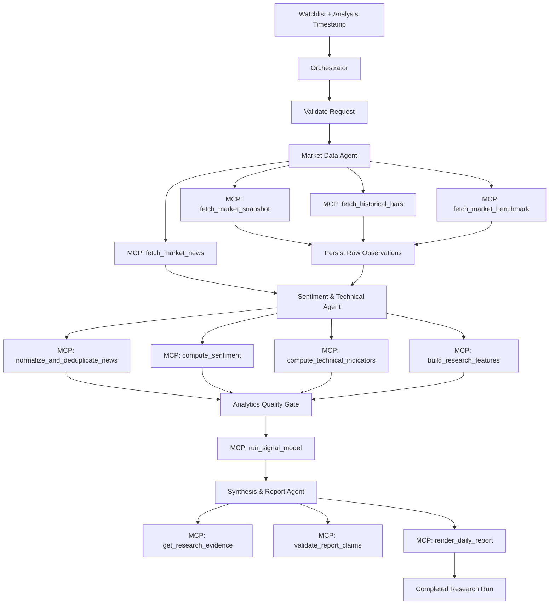
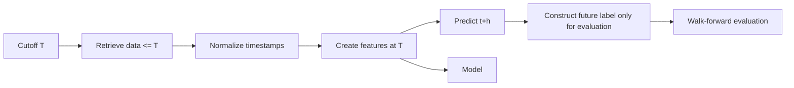
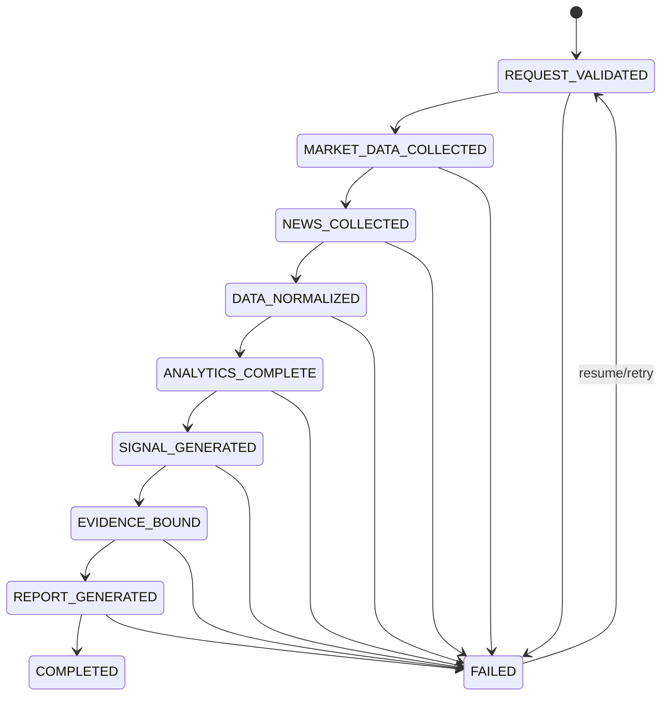

# Pipeline Flow

## 1. End-to-end flow

## 2. Historical point-in-time flow

The feature row at T must never consume observations with information time > T.

## 3. State machine

## 4. Fan-out/fan-in

For a watchlist:
1. validate all symbols;
2. fan out data collection under a bounded concurrency limit;
3. normalize independently;
4. fan in into a single run state;
5. analyze each symbol;
6. produce per-symbol sections plus market-level synthesis.

A provider error for one symbol must not silently invalidate other successful symbols unless the missing symbol is essential to the configured research objective.

## 5. Failure handling

Errors:
- `TRANSIENT_PROVIDER_ERROR` -> bounded retry;
- `RATE_LIMITED` -> backoff;
- `AUTH_ERROR` -> fail fast;
- `STALE_DATA` -> warn or block per policy;
- `EMPTY_RESULT` -> required/optional source policy;
- `SCHEMA_CHANGED` -> fail fast and record provider incident.

## 6. Daily operation

A scheduled run should:
1. determine the intended analysis timestamp;
2. determine market session state;
3. fetch data through the cutoff;
4. analyze news and indicators;
5. generate signal;
6. bind evidence;
7. render report;
8. archive immutable artifacts.
