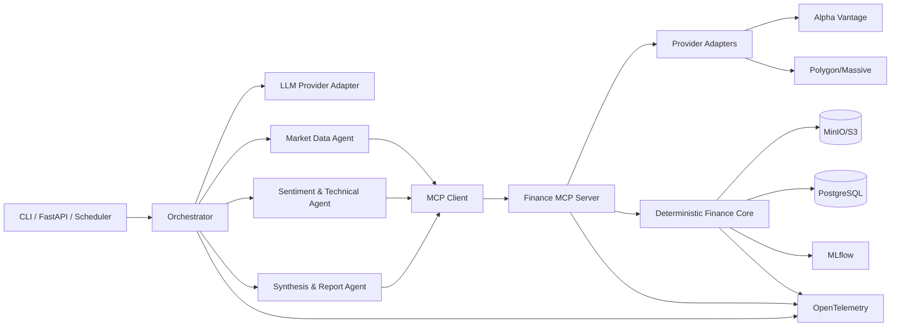

# System Architecture

## 1. Logical architecture



## 2. Responsibilities

### Orchestrator
Owns state, retries, approvals, checkpointing, scheduling integration, and agent context.

### Runtime agents
Own research reasoning, interpretation, and structured handoffs.

### MCP server
Owns tool contracts, authorization, data retrieval, deterministic analytics, and artifact access.

### Provider adapters
Own provider-specific auth, schemas, pagination, retries, entitlement metadata, and transport details.

### Analytics core
Owns indicators, sentiment aggregation, deduplication, feature generation, signal calculation, and historical evaluation.

## 3. Repository structure

```text
agentic-market-research/
├── apps/
│   ├── api/
│   └── orchestrator/
├── services/
│   └── finance_mcp/
├── src/
│   ├── agents/
│   │   ├── market_data.py
│   │   ├── sentiment_technical.py
│   │   └── synthesis_report.py
│   ├── orchestration/
│   ├── finance_core/
│   │   ├── market_data/
│   │   ├── news/
│   │   ├── sentiment/
│   │   ├── indicators/
│   │   ├── features/
│   │   ├── signal/
│   │   └── evaluation/
│   ├── providers/
│   │   ├── base.py
│   │   ├── alphavantage.py
│   │   └── polygon.py
│   ├── contracts/
│   ├── storage/
│   ├── observability/
│   └── llm/
├── configs/
├── fixtures/
├── examples/
├── tests/
├── docs/
├── .claude/
├── CLAUDE.md
├── ANTIGRAVITY_HANDOFF.md
├── pyproject.toml
├── uv.lock
├── docker-compose.yml
├── Makefile
└── README.md
```

## 4. Data flow

Provider API -> provider adapter -> normalized domain model -> immutable raw artifact -> analytics -> feature artifact -> signal artifact -> report.

Provider-specific payloads must not leak into domain/business logic.

## 5. LLM provider boundary

```text
AgentModel.complete(messages, tools, response_schema, trace_context)
    -> StructuredAgentResponse
```

Default adapter: Anthropic. Keep the rest provider-neutral.

## 6. MCP deployment

Local development:
- stdio.

Remote deployment:
- Streamable HTTP.

Target current MCP 2026-07-28 and official Python SDK v2.
